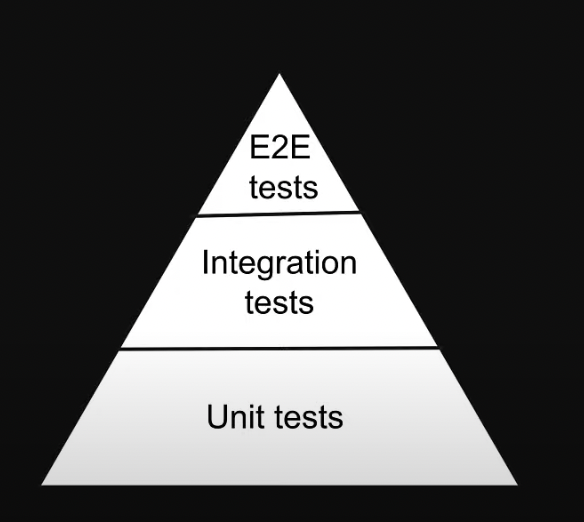

## React Testing

##### CURRICULUM

- Testing Components
- Mocking APIs
- Testing Forms
- Testing State Management
- Testing Authentication
- Testing Routing

##### JEST

- Jest is a javascript testing framework
- Jest is a test runner that finds tests, runs the tests, determines whether the tests passed or failed and reports it back in a human readable manner.

##### React Testing Library (RTL)

- Javascript testing utility that provides virtual DOM for testing React components.
- React Testing Library provides a virtual DOM which we can use to interact with and verify the behaviour of a react component.
- Testing Library is infact a family of packages which helps test Ul components.
- The core library is called DOM Testing library and RTL is simply a wrapper around this core library to test React applications in an easier way.

##### Unit tests

- Focus is on testing the individual building blocks of an application such as a class or a function or a component.
- Each unit or building block is tested in isolation, independent of other units.
- Dependencies are mocked
- Run in a short amount of time and make it very easy to pinpoint failures
- Relatively easier to write and maintain

##### Integration tests

- Focus is on testing a combination of units and ensuring they work together
- Take longer than unit tests

##### E2E tests

- Focus is on testing the entire application flow and ensuring it works as designed from start to finish
- Involves in a real Ul, a real backend database, real services etc
- Take the longest as they cover the most amount of code
- Have a cost implication as you interact with real APIs that may charge based on the number of requests.

#### Testing pyramid



RTL Philosophy

- "The more your tests resemble the way your software is used, the more confidence they can give you."
- Tests we are going to learn to write in this series strike a balance between unit tests in the sense they are at a component level and easy to write and maintain and E2E tests in the sense they resemble the way a user would interact with the component
- With React Testing Library, we are not concerned about the implementation details of a component, Instead we are testing how the component behaves when a user interacts with it
- RTL will not care if you add 4+4 or 5+3 to display the number 8
- Refactoring will not affect your test as long as the end result is the same.

##### Types of tests and RTL

- Unit tests
- Integration tests
- E2E tests
- RTL strikes a balance between unit and E2E tests which is what we will be learning.

###### test

- **Syntax: test(name, fn, timeout)**
- The first argument is the test name used to identify the test
- The second argument is a function that contains the expectations to test
- The third argument is timeout which is an optional argument for specifying how long to wait before aborting the test. The default timeout value is 5 seconds.

###### describe

- **Syntax: describe(name, fn)**
- The first argument is the group name
- The second argument is a function that contains the expectations to test

##### Filename Conventions

- Files with .test.js or .test.tsx suffix.
- Files with .spec.js or .spec.tsx suffix.
- Files with .js or .tsx suffix in \__tests _ folders.
- _Recommendation is to always put your tests next to the code they are testing so that relative imports are shorter._

##### Code Coverage

- A metric that can help you understand how much of your software code is tested
- **Statement coverage:** how many of the statements in the software code have been executed
- **Branches coverage:** how many of the branches of the control structures (if statements for instance) have been executed
- **Function coverage:** how many of the functions defined have been called.
- **Line coverage:** how many of lines of source code have been tested

```
    // To ignore few files
    "coverage": "yarn test --coverage --watchAll --collectCoverageFrom='src/components/**/*.{ts,tsx}' --collectCoverageFrom='!src/components/**/*.{types, stories, constants, test, spec}.{ts,tsx}'"

    // To add jest coverage config in package.json
    "jest": {
      "coverageThreshold": {
        "global": {
          "branches": 80,
          "functions": 80,
          "lines": 80,
          "statements": -10 // 10 uncovered lines.
        }
      }
    },
```

##### Assertions

- When writing tests, we often need to check that values meet certain conditions
- Assertion decides if a test passes or fails.
- **expect(value):** The argument should be the value that your code produces.
- Typically, you will use expect along with a "matcher" function to assert something about a value.

##### What to test?

- Test component renders
- Test component renders with props
- Test component renders in different states
- Test component reacts to events

##### What not to test?

- Implementation details.
- Third party code.
- Code that is not important from a user point of view.

##### RTL Queries

- Every test we write generally involves the following basic steps
  1. Render the component
  2. Find an element rendered by the component
  3. Assert against the element found in step 2 which will pass or fail the test
- To render the component, we use the render method from RTL
- For assertion, we use expect passing in a value and combine it with a matcher function from jest or jest-dom

- Queries are the methods that Testing Library provides to find elements on the page
- To find a single element on the page, we have
  - getBy..
  - queryBy..
  - findBy..
- To find multiple elements on the page, we have
  - getAllBy..
  - queryAllBy..
  - findAllIBy..
- The suffix can be one of Role, LabelText, PlaceHolderText, Text, DisplayValue, AltText, Title and finally Testld

**getBy... queries**

- _getBy.._ class of queries return the matching node for a query, and throw a descriptive error if no elements match or if more than one match is found
- The suffix can be one of Role, LabelText, PlaceHolderText, Text, DisplayValue, AltText, Title and finally Testld

**getByRole**

- _getByRole_ queries for elements with the given role.
- Role refers to the ARIA (Accessible Rich Internet Applications) role which provides semantic meaning to content to ensure people using assistive technologies are able to use them.
- By default, many semantic elements in HTML have a role
- Button element has a button role, anchor element has a link role, h1 to h6 elements have a heading role, checkboxes have a checkbox role, radio buttons have a radio role and so on
- If you're working with elements that do not have a default role or if you want to specify a different role, the role attribute can be used to add the desired role
- Eg: To use an anchor element as a button in the navbar, you can add role="button"

**getByRole Options**

- **name**
- The accessible name is for simple cases equal to
  1. the label of a form element
  2. the text content of a button or
  3. the value of the aria-label attribute
- Other options: level, hidden, selected, checked, pressed

```js
import { render, screen } from "@testing-library/react";
import { Application } from "./application";

describe("Application”, () = {
  test("renders correctly”, () = {
    render (<Application />);

    const pageHeading = screen.getByRole("heading", { level: 1 })
    expect(pageHeading).toBeInTheDocument();

    const sectionHeading = screen.getByRole("heading", { level: 2 })
    expect(sectionHeading).toBeInTheDocument();

    const nameElement = screen.getByRole(" textbox", { name: "Name"});
    expect(nameElement).toBeInTheDocument();

    const bioElement = screen.getByRole("textbox", { name: "Bio"})
    expect (bioElement).toBeInTheDocument();

    const jobLocationElement = screen.getByRole(" combobox");
    expect(jobLocationElement).toBeInTheDocument();

    const termsElement = screen.getByRole("checkbox");
    expect (termsElement).toBeInTheDocument();

    const subnitButtonElement = screen.getByRole("button");
    expect(submitButtonElement).toBeInTheDocument ();
  })
});
```

**getByPlaceholderText**

- getByPlaceholderText will search for all elements with a placeholder attribute and find one that matches the given text

**getByText**

- getByText will search for all elements that have a text node with textContent matching the given text
- Typically, you'd use this to find paragraph, div or span elements

**getByAltText**

- getByAltText will return the element that has the given alt text
- This method only supports elements which accept an alt attribute like img, input, area or custom HTML elements

**getByTitle**

- getByTitle returns the element that has the matching title attribute

**getByTestId**

- getByTestId returns the element that has the matching title attribute

```
  // JSX
  <div data-testid="custom-element">Custom HTML element</div>
  // Test
  const customElement = screen.getByTestId("custom-element");
  expect(customElement).toBeInTheDocument();
```

#### Priority Order for Queries

- "Your test should resemble how users interact with your code (component, page,etc.) as much as possible"
  1. getByRole
  2. getBylLabelText
  3. getByPlaceholderText
  4. getByText
  5. getByDisplayValue
  6. getByAltText
  7. getByTitle
  8. getByTestld

#### getAllBy Queries

1. getAllByRole
2. getAllBylLabelText
3. getAllByPlaceholderText
4. getAllByText
5. getAllByDisplayValue
6. getAllByAltText
7. getAllByTitle
8. getAllByTestld

#### queryBy and queryAllBy

- **queryBy**
- Returns the matching node for a query, and return null if no elements match
- Useful for asserting an element that is not present, Throws an error if more than one match is found
  1. queryByRole
  2. queryBylLabelText
  3. queryByPlaceholderText
  4. queryByText
  5. queryByDisplayValue
  6. queryByAltText
  7. queryByTitle
  8. queryByTestld
- **queryAllBy**
- Returns an array of all matching nodes for a query, and return an empty array if no elements match
  1. queryAllByRole
  2. queryAllBylLabelText
  3. queryAllByPlaceholderText
  4. queryAllByText
  5. queryAllByDisplayValue
  6. queryAllByAltText
  7. queryAllByTitle
  8. queryAllByTestld

#### findBy and findAllBy

- **findBy**
- Returns a Promise which resolves when an element is found which matches the given query
- The promise is rejected if no element is found or if more than one element is found after a default timeout of 1000ms
  1. findByRole
  2. findBylLabelText
  3. findByPlaceholderText
  4. findByText
  5. findByDisplayValue
  6. findByAltText
  7. findByTitle
  8. findByTestld
- **findAllBy**
- Returns a promise which resolves to an array of elements when any elements are found which match the given query.
- The promise is rejected if no elements are found after a default timeout of 1000ms.
  1. findAllByRole
  2. findAllBylLabelText
  3. findAllByPlaceholderText
  4. findAllByText
  5. findAllByDisplayValue
  6. findAllByAltText
  7. findAllByTitle
  8. findAllByTestld

```js
test ("Start learning button is eventually displayed", async () => {
render (<Skills skills={skills} />);
const startLearningButton = await screen.findByRole("button", { name: "Start learning" }, { timeout: 2000});
expect (startLearningButton).toBeInTheDocument();
```

```
  Note:
  - getBy and getAllBy class of queries to assert if elements are present in the DOM
  - queryBy and queryAlIBy class of queries to assert if elements are not present in the DOM
  - findBy and findAlIBy class of queries to assert if elements are eventually present in the DOM
```

#### Manual queries

- document.querySelector("...query")
- NOT recommended to use.

#### Debugging test

```
- Approach 1: screen.debug()
- Approach 2:
  - import { logRoles } from "@testing-library/react"
  - const view = render(<App />)
  - logRoles(view.container)
- Approach 3:
  - use https://testing-playground.com/
```

#### Test User Interactions

- A click using a mouse or a keypress using a keyboard
- Software has to respond to such interactions
- Tests should ensure the interactions are handled as expected

#### user-event

- A companion library for Testing Library that simulates user interactions by dispatching the events that would happen if the interaction took place in a browser
- It is the recommended way to test user interactions with RTL

#### fireEvent vs user-event

- fireEvent is a method from RTL which is used to dispatch DOM events
- **user-event** simulates full interactions, which may fire multiple events and do additional checks along the way
- For example, we can dispatch the change event on an input field using fireEvent When a user types into a text box, the element has to be focused, and then keyboard and input events are fired and the selection and value on the element are manipulated as they type user-event allows you to describe a user interaction instead of a concrete event.
- It adds visibility and intractability checks along the way and manipulates the DOM just like a user interaction in the browser would.
- It factors in that the browser e.g wouldn't let a user click a hidden element or type in a disabled text box

#### Pointer Interactions

- **Convenience APIs**
  - click()
  - dblClick()
  - tripleClick()
  - hover()
  - tab()
  - unhover()
- **Utility APIs**
  - clear() // empty input box
  - selectOptions() // dropdown menu
  - deSelectOptions() // unselect from dropdown menu
  - upload() // file upload
- **Clipboard APIs**
  - cut()
  - copy()
  - paste()
- **Clipboard APIs**
  - keyboard('foo') // translates to: f, 0, 0
  - keyboard('{Shift>}A{/Shift}") // translates to: Shift(down), A, Shift(up)
- **Pointer APIs**
  - pointer({keys: [MouseLeft]'})
  - pointer({keys: '[MouseLeft][Mouseright]'})
  - pointer('[Mouseleft][Mouseright]')
  - pointer('[MouseLeft>]")
  - pointer('[/MouseLeft]')
- **Note:** use convenience api whenever possible

#### Testing Providers

```js
import { render, screen } from "@testing-library/react";
import { AppProviders } from "../../providers/app-providers";
import { MuiMode } from "./mui-mode";

describe("MuiMode", () => {
  test("renders text correctly", () => {
    // Add wrapper in options argument
    render(<MuiMode />, {
      wrapper: AppProviders,
    });
    const headingElement = screen.getByRole("heading");
    expect(headingElement).toHaveTextContent("dark mode");
  });
});
```

#### Custom Renders

- Used if same provider is used in a lot of components, we write a custom provider for that.

```js
import { ReactElement } from 'react'
import { render, RenderOptions } from '@testing-library/react'
import { AppProviders } from './providers/app-providers'

const customRender = (
  ui: ReactElement,
  options?: Omit<RenderOptions, 'wrapper',
)  => render (ui, {wrapper: AppProviders, ...options})

export * from '@testing-library/react'
export { customRender as render }
```

```js
import { render, screen } from "../../test-utils"; // From custom Wrapper Import
import { AppProviders } from "../../providers/app-providers";
import { MuiMode } from "./mui-mode";

describe("MuiMode", () => {
  test("renders text correctly", () => {
    render(<MuiMode />);
    const headingElement = screen.getByRole("heading");
    expect(headingElement).toHaveTextContent("dark mode");
  });
});
```

#### Testing Custom hooks

- import { renderHook } from "@testing-library/react"
- const { result } = renderHook(useCustomHook)
- expect(result.current.count).toBe(1);

```js
const { result } = renderHook(useCounter, {
  initialProps: {
    initialCount: 10,
  }
};
expect (result.current.count).toBe(10);
```

```js
test ("should increment the count”, () => {
  const { result } = renderHook(useCounter);
  // wrap custom hook function call in act
  act(() => result.current.increment());
  expect (result.current.count).toBe(1);
};
```

#### Mocking functions

- use jest.fn() to mock functions

```js
test("handlers are called", async () => {
  user.setup();
  const incrementHandler = jest.fn();
  const decrementHandler = jest.fn();
  render(
    <CounterTwo
      count={0}
      handleIncrement={incrementHandler}
      handleDecrement={decrementHandler}
    />
  );
  const incrementButton = screen.getByRole("button", { name: "Increment" });
  const decrementButton = screen.getByRole("button", { name: "Decrement" });
  await user.click(incrementButton);
  await user.click(decrementButton);
  expect(incrementHandler).toHaveBeenCalledTimes(1);
  expect(decrementHandler).toHaveBeenCalledTimes(1);
});
```

#### Mocking HTTP requests

- use msw (mock service worker package)
- `npm i -D msw` add as dev dependencies
- add server and handlers files, use msw docs

```js
import { useState, useEffect } from "react";

export const Users = () => {
  const [users, setUsers] = useState<string[l>([]);
  const [error, setError] = useState<string | null>(null);

  useEffect(() => {
    fetch("https://jsonplaceholder.typicode.com/users")
    .then((res) => res.json())
    .then( (data) => setUsers(data.map( (user: { name: string }) => user.name)))
    .catch(() => setError("Error fetching users"));
  }, []);

return (
  <div>
    <h1>Users</h1>
    {error & <p>{error}</p>}
    <ul>
      {users.map( (user) => (
        <li key={user}>{user}</li>
      ))}
    </ul>
  </div>
);
```

```ts
// setupTests.ts

import "@testing-library/jest-dom";
import { server } from "./mocks/server";
// Establish API mocking before all tests.
beforeAll(() => server.listen());
// Reset any request handlers that we may add during the tests,
// so they don't affect other tests.
afterEach(() => server.resetHandlers());
// Clean up after the tests are finished.
afterAll(() => server.close());
```

```ts
// src/mocks/server.js
import { setupServer } from "msw/node";
import { handlers } from "./handlers";

// This configures a request mocking server with the given request handlers.
export const server = setupServer(...handlers);
```

```ts
// Handlers.ts
import { rest } from "msw";

export const handlers = [
  rest.get("https://jsonplaceholder.typicode.com/users", (req, res, ctx) => {
    return res(
      ctx.status (200),
      ctx.json([
      {
      name: "Bruce Wayne",
      },
      {
      name: "Clark Kent",
      },
      {
      name: "Princess Diana",
      }]
    )})
];
```

```ts
import { render, screen } from "@testing-library/react";
import { rest } from "msw";
import { Users } from "./users";
import { server } from "../../mocks/server";

describe("Users", () => {
  test("renders a list of users", async () => {
    render (<Users />);
    const users = await screen. findAl1ByRole("listitem");
    expect (users). toHavelLength(3);
  }

  test("renders error", async () => {
      server.use(
        rest.get("https://jsonplaceholder.typicode.com/users",
          (req, res, ctx) => res(ctx.status(500))))
      render (<Users />);
      const error = await screen.findByText("Error fetching users");
      expect (error).toBeInTheDocument();
  })
})
```

#### Test Driven Development (TDD)

- Test driven development is a software development process where you write tests
  before writing the software code
- Once the tests have been written, you then write the code to ensure the tests pass
- Create tests that verify the functionality of a specific feature
- Write software code that will run the tests successfully when re-executed
- Refactor the code for optimization while ensuring the tests continue to pass
- Also called red-green testing as all tests go from a red failed state to a green.

#### Static analysis testing

- Process of verifying that your code meets certain expectations without actually running it
- Ensure consistent style and formatting
- Check for common mistakes and possible bugs
- Limit the complexity of code and
- Verify type consistency
- All types of tests run the code and then compare the outcome against known expected outputs to see if everything works OK
- Static testing analyses aspects such as readability, consistency, error handling, type checking, and alignment with best practices
- Testing checks if your code works or not, whereas static analysis checks if it is written well or not

#### Static analysis testing tools

- Used to improve code quality
  - TypeScript
  - ESlint
  - Prettier
  - Husky
  - lint-staged

##### ESLint

- ESLint is a linter which identifies and reports patterns in our source code to avoid bugs when possible
- `npm i -D eslint-plugin-jest-dom`
- Add plugin in eslintConfig in package.json

```json
// package.json
"eslintConfig": {
  "extends": [
    "react-app",
    "react-app/jest",
    "plugin: jest-dom/ recommended"
  ]
}
```

- Add in npm scripts `"lint": "eslint —-ignore-path .gitignore ."`
- `npm run lint`

##### Prettier

- Prettier is an opinionated code formatter that ensures that all outputted code conforms to a consistent style
- `npm i -D --exact prettier`
- Add in npm scripts to format all files except mentioned in .gitignore
- `"format": "prettier --ignore-path .gitignore —-write \"**/*.{ts,tsx,css,scss}\""`
- `npm run format` to run prettier

- To create custom prettier config add `.prettierrc.json` parallel to package.json

```json
{
  "semi": false,
  "singleQuote": true
}
```

- using eslint and prettier can cause some conflicting rules.
- To address do `npm i -D eslint-config-prettier`
- Add to eslintConfig

```json
// package.json
"eslintConfig": {
  "extends": [
    "react-app",
    "react-app/jest",
    "plugin: jest-dom/ recommended",
    "eslint-config-prettier"
  ]
}
```

- To create custom eslint config add `.eslintrc.json` parallel to package.json

#### Husky

- Husky is a tool that helps improve your commits and more
- `npx husky-init && npm` sets up husky, modifies package.json and create a sample pre commit hook that we can edit.

```js
// File path: .husky > pre-commit
#!/usr/bin/env sh
. "$(dirname —— "$0")/_/husky.sh"
npm run lint && npm run format
```

- Anytime we try to commit, scripts in pre-commit file is run, if scripts throws an error commits are aborted
- With husky we can ensure developers can't commit code with linting errors and the code they commit are already formatted.

#### lint-staged

- Run linters (and formatters) against staged git files
- Install as dev dependencies `npm i -D lint-staged`

```json
"lint-staged": {
  "*.{ts, tsx}": ["eslint"],
  "*.{ts, tsx, css, scss}": ["prettier --write"]
}
```

```js
// File path: .husky > pre-commit
#!/usr/bin/env sh
. "$(dirname —— "$0")/_/husky.sh"
npx lint-staged
```

```json
// Creates pre push hook, all test run, will commit only if all test pass
npx husky add .husky/pre-push "npm test — —-watchAll=false"
```
