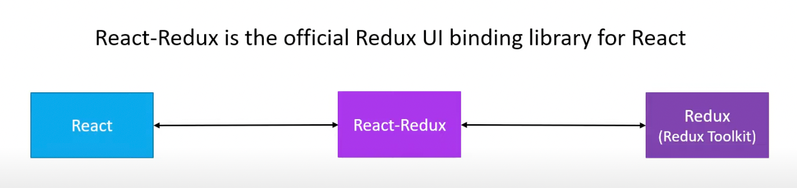
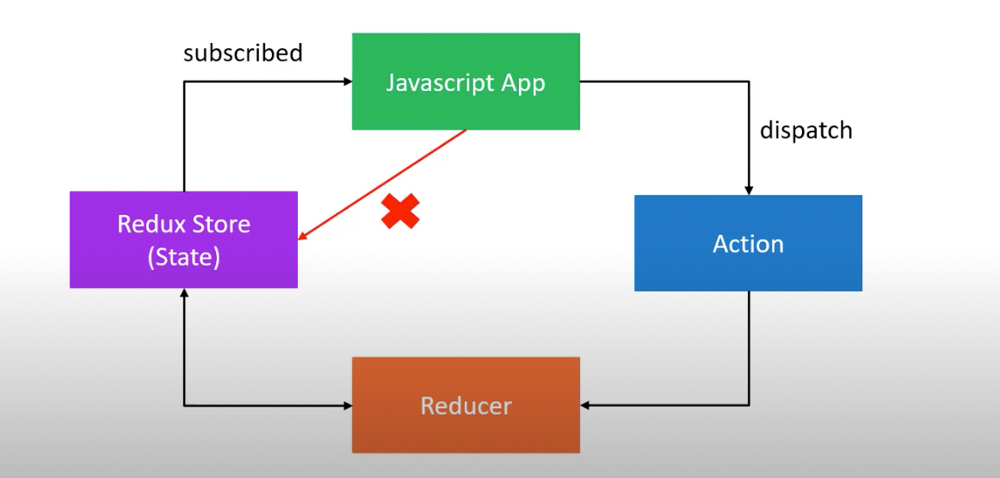

# Redux, Redux Toolkit and React Redux

### What is Redux?
- Redux is a predictable state container for Javascript based apps.
- Redux is not tied to React, it can also be used with Angular, Vue, Vanilla JS.

##### Why Redux?
- If we want to manage the global state of your application in a predictable way, redux can help us.
- The patterns and tools provided by Redux make it easier to understand when, where, why, and how the state in our application is being updated, and how our application logic will behave when those changes occur
- Redux guides us towards writing code that is predictable and testable, which helps give us confidence that our application will work as expected

### What is Redux Toolkit?
- Redux toolkit is the official, opinionated batteries-included toolset for efficient Redux development.
- It is also intended to be the standard way to write Redux logic in our application.

##### Why Redux Toolkit?
Redux is great, but it does have a few shortcomings
- Configuring redux in an app seems complicated
- In addition to redux, a lot of other packages have to be installed to get redux to do something useful
- Redux requires too much boilerplate code
- Redux toolkit serves as an abstraction over redux. It hides the difficult parts ensuring we have a good developer experience.

```
Redux or Redux toolkit don't need a UI library to work, 
It can work with Vanilla JS application.
```

### What is React-Redux?


##### Summary
- React is a library used to build user interfaces.
- Redux is a library for managing state in a predictable way in JavaScript applications.
- Redux toolkit is a library for efficient redux development.
- React-redux is a library that provides bindings to use React and Redux (Toolkit) together in an application.

**When to use redux in a react application?**
- We have large amounts of application state that are needed in many places in the app
- The app state is updated frequently over time.
- The logic to update that state may be complex.
- The app has a medium or large-sized codebase, and might be worked on by many people.

#### Three core concepts
- A **store** that holds the state of your application.
- An **action** that describes what happened in the application.
- A **reducer** which handles the action and decides how to update the state.



##### Redux Store
- One store for the entire application.
- Holds application state.
- Allows access to state via **getState()**.
- Allows state to be updated via **dispatch(action)**.
- Registers listeners via **subscribe(listener)**.
- Handles unregistering of listeners via the function returned by subscribe(listener)

##### Actions
- The only way our application can interact with the store.
- Carry some information from your app to the redux store
- Plain JavaScript objects
- Have a ‘type’ property that describes something that happened in the application.
- May carry a payload to assist transaction.

##### Reducers
- Specify how the app’s state changes in response to actions sent to the store
- Function that accepts state and action as arguments, and returns the next state of the application
- (previousState, action) => newState
- Should be pure functions (for predictable state management).

##### Middlewares
- Is the suggested way to extend Redux with custom functionality
- Provides a third-party extension point between dispatching an action, and the moment it reaches the reducer
- Use middleware for logging, crash reporting, performing asynchronous tasks etc

#### Redux Toolkit
- Redux toolkit is the official, opinionated, batteries-included toolset for efficient Redux development
- Abstract over the setup process
- Handle the most common use cases
- Include some useful utilities